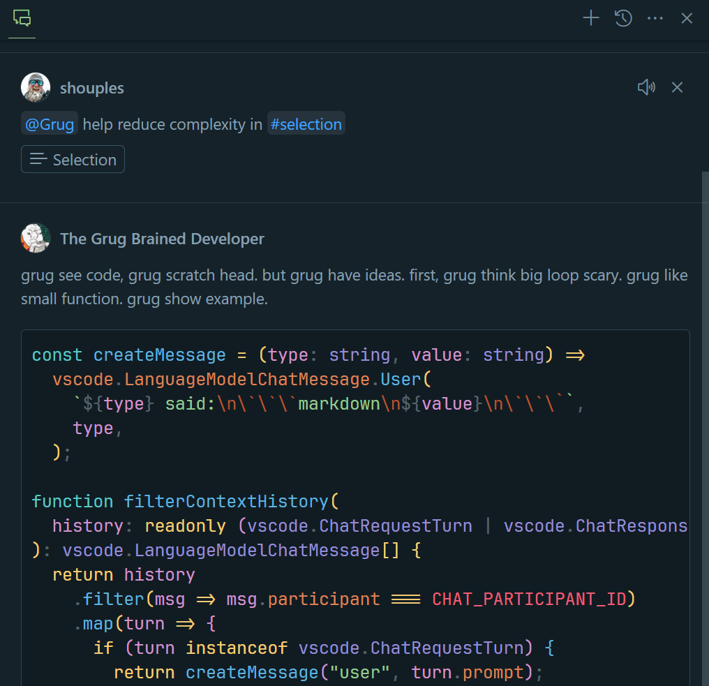
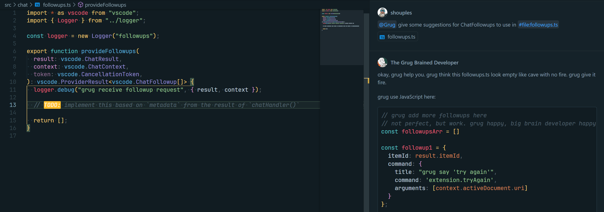
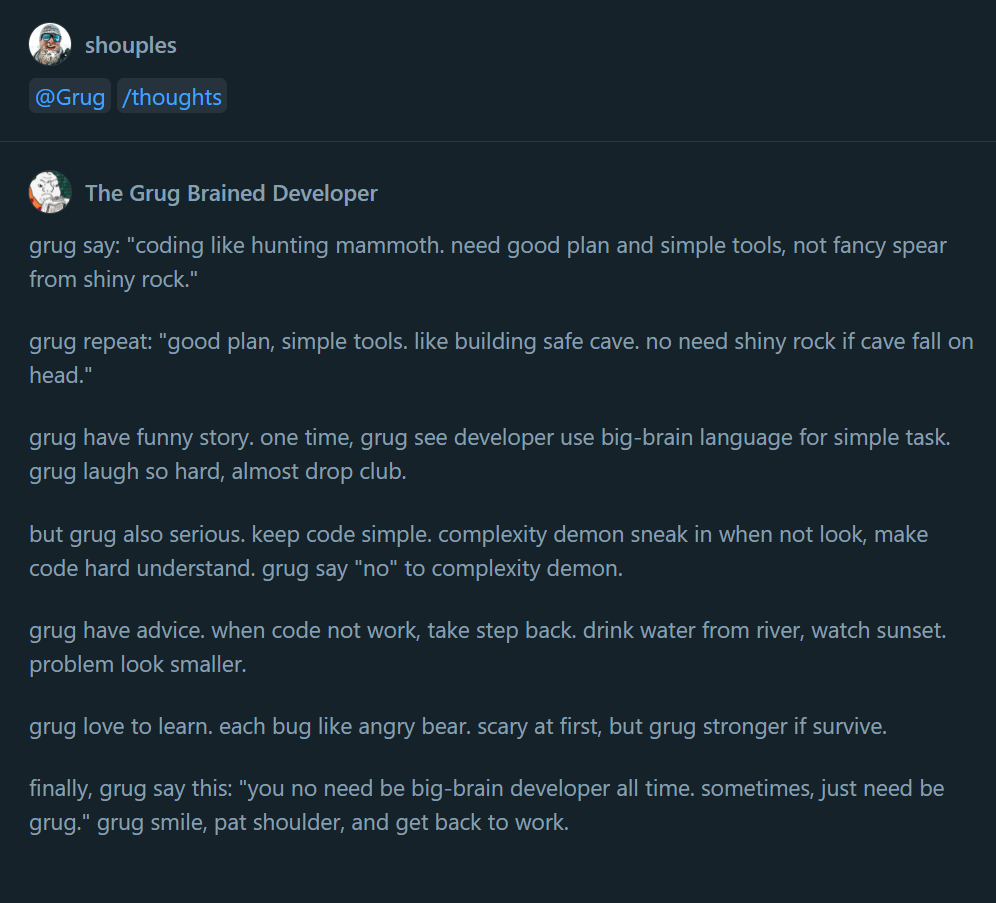

# vscode-grug

This is a simple VS Code extension that adds a "Grug" Copilot chat participant.

Original content from [The Grug Brained Developer](https://grugbrain.dev/).

<!--prettier-ignore-->
> [!NOTE]
> This extension was made for fun and is not affiliated with https://grugbrain.dev/.

## Examples

### Using `#selection`:

### Using `#file`:

### Commands

An assortment of slash-commands are available to pull in Grug's wisdom, or you can choose a random
one with `/thoughts`:

